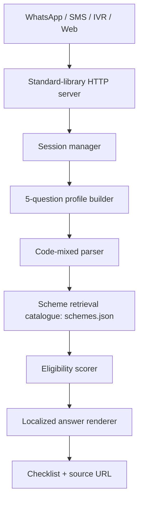

# Architecture And Safety

## System Overview



## Main Components

- `app.py`: HTTP server, static UI, JSON API, Twilio-compatible webhook endpoints, IVR TwiML endpoint.
- `src/chatbot.py`: conversation state, language detection, profile parsing, code-mixed keyword handling, retrieval, scoring, checklist rendering.
- `src/i18n.py`: Hindi, Tamil, and English prompts.
- `data/schemes.json`: grounded scheme catalogue with benefits, documents, steps, source URLs, and SMS hints.
- `static/`: 9 KB lightweight web UI.
- `tests/`: core flow tests.
- `scripts/quality_check.py`: local latency and payload-size check.

## RAG/Hallucination Control

This prototype uses a deterministic local retrieval layer instead of a free-form LLM call. The approach is deliberately conservative:

- All scheme facts come from `data/schemes.json`.
- Each result includes a source URL.
- Unknown questions return a refusal/fallback instead of invented advice.
- State-specific and final eligibility decisions are marked as requiring official verification.
- User-facing language says "shortlist" and "likely" rather than "approved".

An LLM can be added later behind the same boundary: retrieve `schemes.json` snippets first, then instruct the model to answer only from those snippets and return "not enough information" otherwise.

## Code-Mixing Handling

The parser recognizes common Hindi, Tamil, English, and transliterated tokens:

- Aadhaar variants: `aadhaar`, `adhar`, `aadhar`, `आधार`, `ஆதார்`.
- Lost-document phrases: `lost`, `missing`, `खो`, `गुम`, `தொலை`.
- Work phrases: `kisan`, `किसान`, `விவசாய`, `labour`, `मजदूर`, `கூலி`, `delivery`, `driver`.
- Rural/urban phrases: `gaon`, `गांव`, `கிராம`, `city`, `शहर`, `நகர`.

Example:

```text
User: मेरा aadhaar खो गया
Bot: आधार खो गया/नहीं है... CSC/आधार सेवा केंद्र पर पुनःप्राप्ति/अपडेट कराएं...
```

## Low-Bandwidth Design

- Static UI size: about 9.1 KB.
- No external fonts, scripts, images, or model calls.
- SMS responses are capped and use compact scheme hints.
- The eligibility flow is compressed to 5 user answers after language choice.
- The same engine powers SMS, WhatsApp, IVR, and web so deployment does not fork logic.

## Privacy

- Prototype stores sessions in memory only.
- No database is used by default.
- No Aadhaar number is required in the chat; the user only says whether documents exist.
- For production, add consent text, data-retention limits, encryption at rest, audit logs, and local-language privacy notices.

## Known Limits

- It does not replace final government eligibility verification.
- It does not cover all state variations.
- It uses a curated catalogue rather than a live MyScheme scrape.
- IVR text-to-speech quality depends on the telephony provider's language support.
- Field usability still needs real-user validation.
