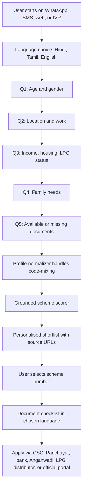
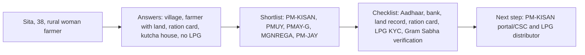
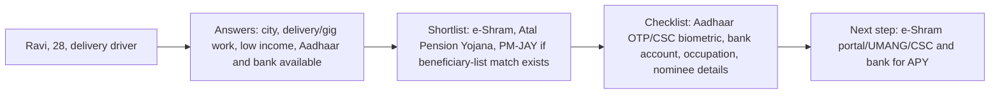
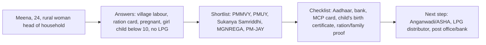

# User Flow Diagram

## Channel Entry

## Persona 1: Farmer Household

## Persona 2: Gig Worker

## Persona 3: Woman Head Of Household

## Low-Friction Channel Choice

For a user with a Rs 500 keypad phone, SMS and IVR are the safest fallbacks because they do not require mobile data or app literacy. WhatsApp is better when a shared family smartphone is available because it supports longer text, document links, and language rendering. The project therefore supports all three:

- SMS: short text responses, no media dependency.
- IVR: voice-first flow for low literacy.
- WhatsApp: richer checklist delivery when data is available.

## Offline Fallback

If the user has no data balance:

- Use SMS keyword flow through `/webhook/sms`.
- Use IVR through `/webhook/ivr`.
- Send a compact checklist that can be shown to a CSC operator, Panchayat secretary, ASHA, Anganwadi worker, bank mitra, or LPG distributor.
- Cache the scheme catalogue locally; no live model call is required for core eligibility.
